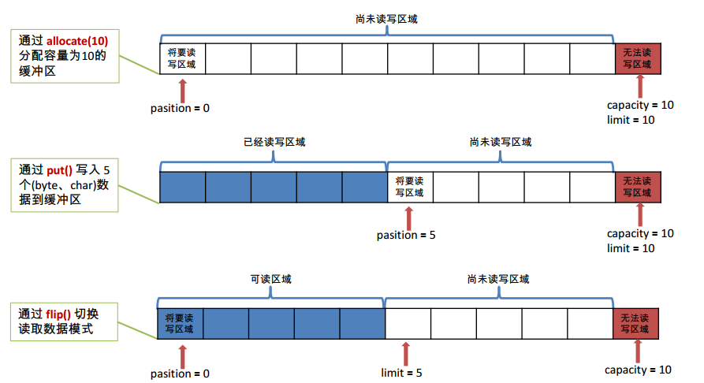
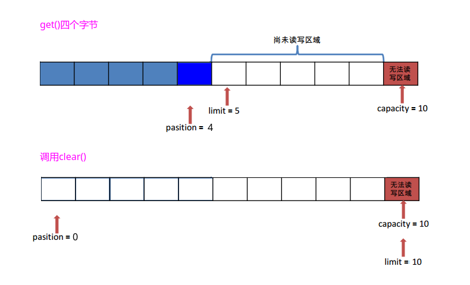
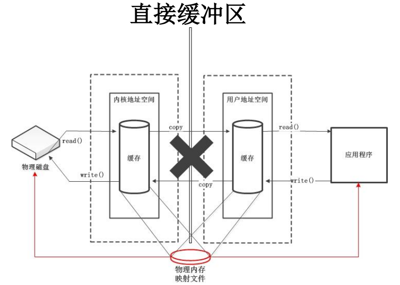

# NIO基础

* Java NIO 与 IO 的主要区别
* 缓冲区(Buffer)
* 通道(Channel)
* 文件通道(FileChannel)
* NIO 的非阻塞式网络通信
  * 选择器(Selector)
  * SocketChannel、ServerSocketChannel、DatagramChannel
* 管道(Pipe)
* Java NIO2 (Path、Paths 与 Files )

## 一、Java NIO 与 IO 的主要区别

NIO与原来的IO有同样的作用和目的，但是使用的方式完全不同，**NIO支持面向缓冲区的、基于通道的IO操作**。NIO将以更加高效的方式进行文件的读写操作。

| IO                      | NIO                         |
| ----------------------- | --------------------------- |
| 面向流(Stream Oriented) | 面向缓冲区(Buffer Oriented) |
| 阻塞IO(Blocking IO)     | 非阻塞IO(Non Blocking IO)   |
| (无)                    | 选择器(Selectors)           |

## 二、缓冲区(Buffer)

Java NIO系统的核心在于：通道(Channel)和缓冲区(Buffer)。

缓冲区（Buffer）

*  缓冲区（Buffer）：**一个用于特定基本数据类型的容器**。由 java.nio 包定义的，所有缓冲区都是 Buffer 抽象类的子类。

*  Java NIO 中的 Buffer 主要用于与 NIO 通道进行交互，**数据是从通道读入缓冲区，从缓冲区写入通道中的**。

### 1、缓冲区Buffer

Buffer 就像一个数组，可以保存多个相同类型的数据。根据数据类型不同(boolean 除外) ，有以下 Buffer 常用子类: `ByteBuffer、CharBuffer、ShortBuffer、IntBuffer、LongBuffer`等。

上述 Buffer 类 他们都采用相似的方法进行管理数据，只是各自管理的数据类型不同而已。都是通过如下方法获取一个 Buffer 对象：

```java
static XxxBuffer allocate(int capacity) : 创建一个容量为 capacity 的 XxxBuffer 对象
```

缓冲区的基本属性、Buffer 中的重要概念：

* **容量 (capacity)** ：表示 Buffer 最大数据容量，缓冲区容量不能为负，并且创建后不能更改。

* **限制 (limit)**：第一个不应该读取或写入的数据的索引，即位于 limit 后的数据不可读写。缓冲区的限制不能为负，并且不能大于其容量。

* **位置 (position)**：下一个要读取或写入的数据的索引。缓冲区的位置不能为负，并且不能大于其限制

* **标记 (mark)与重置 (reset)**：标记是一个索引，通过 Buffer 中的 mark() 方法指定 Buffer 中一个特定的 position，之后可以通过调用 reset() 方法恢复到这个 position.

标记、位置、限制、容量遵守以下不变式： `0 <= mark <= position <= limit <= capacity`





改变的过程: 

* 1)、新建一个大小为 10 个字节的缓冲区，此时 position 为 0，而 `limit = capacity = 10`。capacity 变量不会改变，下面的讨论会忽略它。
* 2)、从输入通道中读取 5 个字节数据写入缓冲区中，此时 position 为 5，limit 保持不变。
* 3)、在将缓冲区的数据写到输出通道之前，需要先调用 `flip()` 方法，**这个方法将 limit 设置为当前 position**，并将 position 设置为 0。
*  4)、从缓冲区中取 4 个字节到输出缓冲中，此时 position 设为 4。
*  5)、最后需要调用 clear() 方法来清空缓冲区，此时 position 和 limit 都被设置为最初位置。

测试: 

```java
/**
 * 一、通过 allocate() 获取缓冲区
 * 二、缓冲区存取数据的两个核心方法：
     * put() : 存入数据到缓冲区中
     * get() : 获取缓冲区中的数据
 * 三、缓冲区中的四个核心属性：
     * capacity :  容量，表示缓冲区中最大存储数据的容量。一旦声明不能改变。
     * limit :    界限，表示缓冲区中可以操作数据的大小。（limit 后数据不能进行读写）
     * position : 位置，表示缓冲区中正在操作数据的位置。
     * mark :     标记，表示记录当前 position 的位置。可以通过 reset() 恢复到 mark 的位置
     * 0 <= mark <= position <= limit <= capacity
 * 四、直接缓冲区与非直接缓冲区：
     * 非直接缓冲区：通过 allocate() 方法分配缓冲区，将缓冲区建立在 JVM 的内存中
     * 直接缓冲区：通过 allocateDirect() 方法分配直接缓冲区，将缓冲区建立在物理内存中。可以提高效率
 */
public class NIO_01_Buffer {

    static PrintStream out = System.out;

    public static void main(String[] args) {
        String str = "abcde";

        //1. 分配一个指定大小的缓冲区
        ByteBuffer buf = ByteBuffer.allocate(1024);

        out.println("----------------allocate()----------------");
        out.println(buf.position() + " " + buf.limit() + " " + buf.capacity()); //0 1024 1024

        //2. 利用 put() 存入数据到缓冲区中
        buf.put(str.getBytes());

        out.println("-----------------put()----------------");
        out.println(buf.position() + " " + buf.limit() + " " + buf.capacity()); // 5 1024 1024

        //3. 切换读取数据模式
        buf.flip();

        out.println("-----------------flip()----------------");
        out.println(buf.position() + " " + buf.limit() + " " + buf.capacity()); // 0 5 1024

        //4. 利用 get() 读取缓冲区中的数据
        byte[] dst = new byte[buf.limit()];
        buf.get(dst);
        out.println(new String(dst, 0, dst.length));

        out.println("-----------------get()----------------");
        out.println(buf.position() + " " + buf.limit() + " " + buf.capacity()); // 5 5 1024

        //5. rewind() : 可重复读
        buf.rewind();

        out.println("-----------------rewind()----------------");
        out.println(buf.position() + " " + buf.limit() + " " + buf.capacity()); // 0 5 1024

        //6. clear() : 清空缓冲区. 但是缓冲区中的数据依然存在，但是处于“被遗忘”状态
        buf.clear();


        //7. clear()之后数据依然存在，处于遗忘状态
        out.println("-----------------clear()----------------");
        out.println(buf.position() + " " + buf.limit() + " " + buf.capacity()); //0 1024 1024

        out.println((char) buf.get()); // 依然存在
    }
}

```

输出：

```java
----------------allocate()----------------
0 1024 1024
-----------------put()----------------
5 1024 1024
-----------------flip()----------------
0 5 1024
abcde
-----------------get()----------------
5 5 1024
-----------------rewind()----------------
0 5 1024
-----------------clear()----------------
0 1024 1024
a
```

### 2、Buffer常用方法

| 方 法                  | 描 述                                                     |
| ---------------------- | --------------------------------------------------------- |
| Buffer clear()         | 清空缓冲区并返回对缓冲区的引用                            |
| Buffer flip()          | 将缓冲区的界限设置为当前位置，并将当前位置充值为 0        |
| int capacity()         | 返回 Buffer 的 capacity 大小                              |
| boolean hasRemaining() | 判断缓冲区中是否还有元素                                  |
| int limit()            | 返回 Buffer 的界限(limit) 的位置                          |
| Buffer limit(int n)    | 将设置缓冲区界限为 n, 并返回一个具有新 limit 的缓冲区对象 |
| Buffer mark()          | 对缓冲区设置标记                                          |
| int position()         | 返回缓冲区的当前位置 position                             |
| Buffer position(int n) | 将设置缓冲区的当前位置为 n , 并返回修改后的 Buffer 对象   |
| int remaining()        | 返回 position 和 limit 之间的元素个数                     |
| Buffer reset()         | 将位置 position 转到以前设置的 mark 所在的位置            |
| Buffer rewind()        | 将位置设为为 0， 取消设置的 mark                          |

Buffer 所有子类提供了两个用于数据操作的方法：get() 与 put() 方法

获取 Buffer 中的数据

* get() ：读取单个字节；
* get(byte[] dst)：批量读取多个字节到 dst 中；
* get(int index)：读取指定索引位置的字节(不会移动 position)；

放入数据到 Buffer 中

* put(byte b)：将给定单个字节写入缓冲区的当前位置；
* put(byte[] src)：将 src 中的字节写入缓冲区的当前位置；
* put(int index, byte b)：将指定字节写入缓冲区的索引位置(不会移动 position)；

测试一下`mark`的作用: 

```java
public class NIO_02_Buffer_mark {
    public static void main(String[] args){

        String str = "abcde";
        ByteBuffer buf = ByteBuffer.allocate(1024);
        buf.put(str.getBytes());
        
        //读模式
        buf.flip();

        byte[] dst = new byte[buf.limit()];
        buf.get(dst, 0, 2);
        System.out.println(new String(dst, 0, 2));
        System.out.println(buf.position());

        //mark() : 标记
        buf.mark();

        buf.get(dst, 2, 2);
        System.out.println(new String(dst, 2, 2));
        System.out.println(buf.position());

        //reset() : 恢复到 mark 的位置
        buf.reset();
        System.out.println(buf.position());

        //判断缓冲区中是否还有剩余数据
        if(buf.hasRemaining()){
            System.out.println(buf.remaining());//获取缓冲区中可以操作的数量
        }
    }
}
```

输出:

```java
ab
2
cd
4
2
3
```

### 3、直接与非直接缓冲区

字节缓冲区要么是直接的，要么是非直接的。

如果为直接字节缓冲区，则 Java 虚拟机会尽最大努力直接在此缓冲区上执行**本机 I/O 操作**。也就是说，在每次调用基础操作系统的一个本机 I/O 操作之前（或之后），虚拟机都会尽量**避免将缓冲区的内容复制到中间缓冲区中（或从中间缓冲区中复制内容）**。

直接字节缓冲区可以通过调用此类的` allocateDirect()` 工厂方法来创建。

此方法返回的缓冲区进行分配和取消分配所需成本通常高于非直接缓冲区。直接缓冲区的内容可以驻留在常规的垃圾回收堆之外，因此，它们对应用程序的内存需求量造成的影响可能并不明显。所以，**建议将直接缓冲区主要分配给那些易受基础系统的本机 I/O 操作影响的大型、持久的缓冲区**。一般情况下，最好仅在直接缓冲区能在程序性能方面带来明显好处时分配它们。

**直接字节缓冲区还可以通过 FileChannel 的 map() 方法 将文件区域直接映射到内存中来创建**。该方法返回
`MappedByteBuffer` 。Java 平台的实现有助于通过 JNI 从本机代码创建直接字节缓冲区。如果以上这些缓冲区
中的某个缓冲区实例指的是不可访问的内存区域，则试图访问该区域不会更改该缓冲区的内容，并且将会在
访问期间或稍后的某个时间导致抛出不确定的异常。

> 字节缓冲区是直接缓冲区还是非直接缓冲区可通过调用其 `isDirect()` 方法来确定。提供此方法是为了能够在性能关键型代码中执行显式缓冲区管理。




## 三、通道(Channel)

通道（Channel）：由 java.nio.channels 包定义的。Channel 表示 IO 源与目标打开的连接。
Channel 类似于传统的“流”。只不过 Channel 本身不能直接访问数据，Channel 只能与Buffer 进行交互。

通道`Channel`：

- 通道表示**打开到 IO 设备(例如：文件、套接字)的连接**。
- 若需要使用 NIO 系统，**需要获取用于连接 IO 设备的通道以及用于容纳数据的缓冲区**。
- 然后操作缓冲区，对数据进行处理。


Java 为 Channel 接口提供的最主要实现类如下：

* FileChannel：用于读取、写入、映射和操作文件的通道；
* DatagramChannel：通过 UDP 读写网络中的数据通道；
* SocketChannel：通过 TCP 读写网络中的数据；
* ServerSocketChannel：可以监听新进来的 TCP 连接，对每一个新进来的连接都会创建一个SocketChannel；

获取通道的一种方式是对支持通道的对象调用`getChannel()` 方法。支持通道的类如下：

* FileInputStream、FileOutputStream
* RandomAccessFile
* DatagramSocket、Socket、ServerSocket

获取通道的其他方式是使用 Files 类的静态方法 `newByteChannel() `获取字节通道。

或者通过通道的静态方法` open() `打开并返回指定通道。


基础使用，使用`Channel`完成文件的复制: 

```java
static void testCopyFileUseChannel() throws Exception {
    long start = System.currentTimeMillis();

    //① 获取通道
    FileInputStream fis = new FileInputStream("/home/zxzxin/Java_Maven/socket/src/nio/1.jpg");
    FileOutputStream fos = new FileOutputStream("/home/zxzxin/Java_Maven/socket/src/nio/2.jpg");

    FileChannel inChannel = fis.getChannel();
    FileChannel outChannel = fos.getChannel();

    //② 分配指定大小的缓冲区
    ByteBuffer buf = ByteBuffer.allocate(1024);

    //③ 将通道中的数据存入缓冲区中
    while (inChannel.read(buf) != -1) {
        buf.flip();   //切换读取数据的模式

        outChannel.write(buf);//④将缓冲区中的数据写入通道中
        buf.clear();   //清空缓冲区
    }

    // 关闭
    outChannel.close();
    inChannel.close();
    fos.close();
    fis.close();

    long end = System.currentTimeMillis();
    System.out.println("耗费时间为：" + (end - start));
}
```

