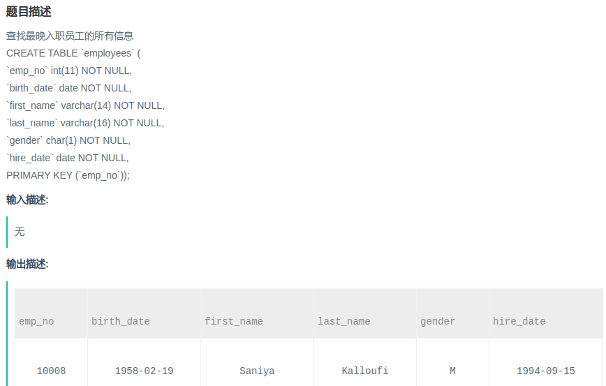
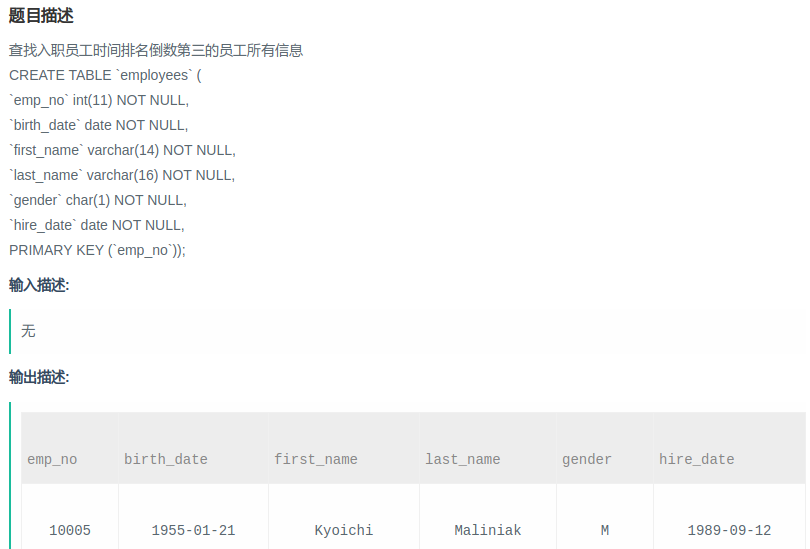
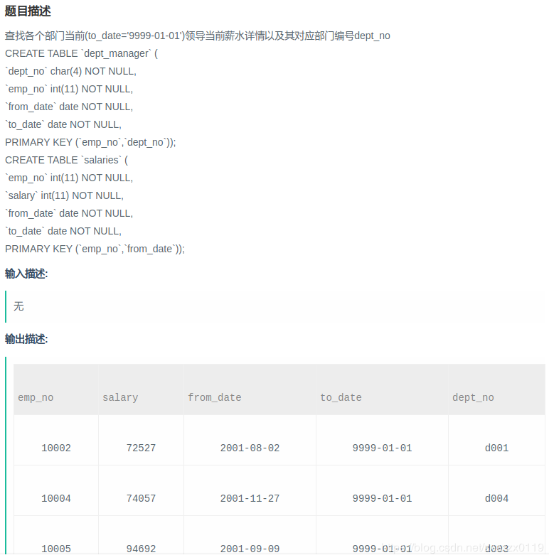
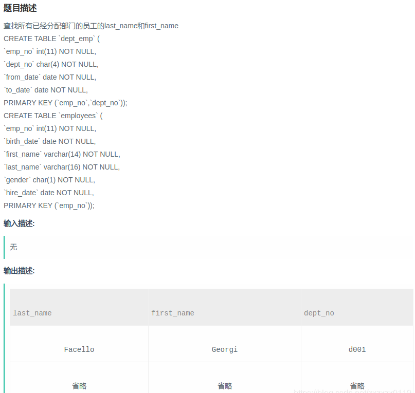
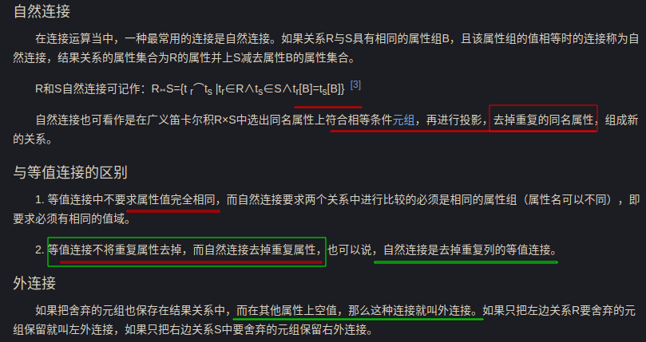
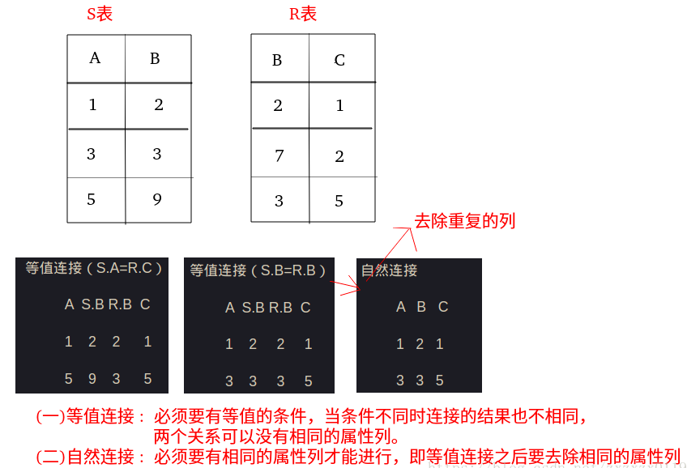
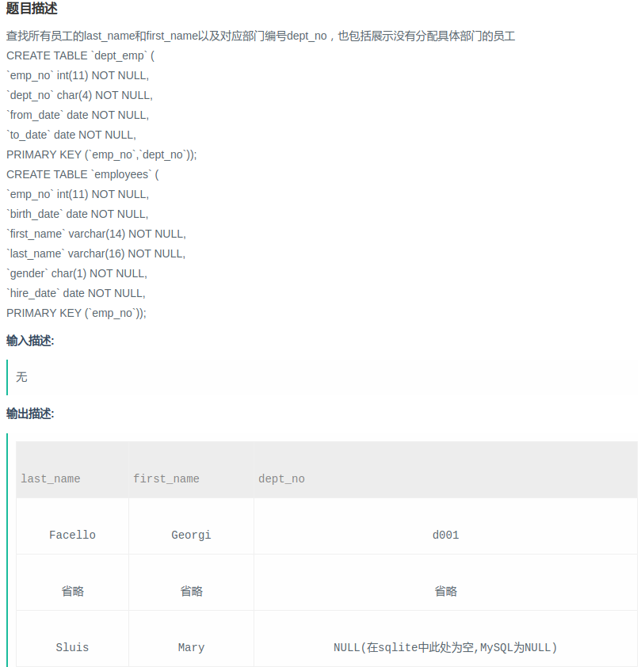
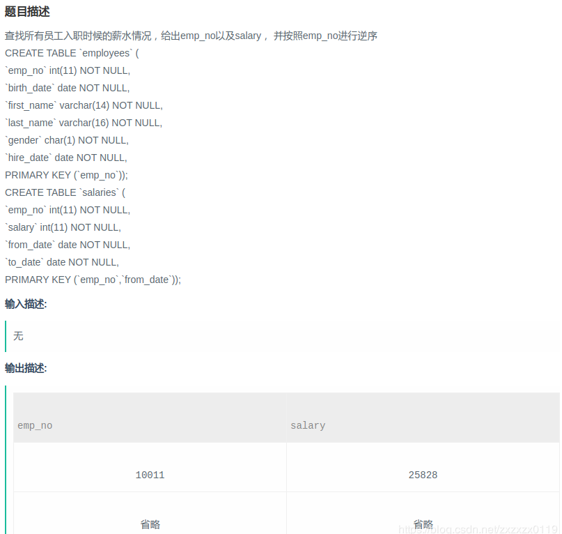

## 数据库实战每日6题(1 ~ 6)
* 查找最晚入职员工的所有信息
* 查找入职员工时间排名倒数第三的员工所有信息
* 查找当前薪水详情以及部门编号`dept_no`
* 查找所有已经分配部门的员工的`last_name`和`first_name`
* 查找所有员工的`last_name`和`first_name`以及对应部门编号`dept_no`
* 查找所有员工入职时候的薪水情况
***
### 查找最晚入职员工的所有信息
#### [题目链接](https://www.nowcoder.com/practice/218ae58dfdcd4af195fff264e062138f?tpId=82&tqId=29753&tPage=1&rp=&ru=/ta/sql&qru=/ta/sql/question-ranking)

> https://www.nowcoder.com/practice/218ae58dfdcd4af195fff264e062138f?tpId=82&tqId=29753&tPage=1&rp=&ru=/ta/sql&qru=/ta/sql/question-ranking

#### 题目

#### 解析
* 思路一: 使用嵌套查询(子查询)，内层查询先查询出来表中的最大的`hire_date`，外层再查一次；
* 思路二: 按照`hire_date`降序排列，然后使用`limit`关键字取出第一项即可；

```sql
select * from employees where hire_date = (select max(hire_date) from employees);

select * from employees order by hire_date desc limit 0,1;

select * from employees order by hire_date desc limit 1;
```
注意limit关键字的使用：
* `LIMIT m,n` : 表示从第`m+1`条开始，取`n`条数据；
* `LIMIT n `： 表示从第`0`条开始，取`n`条数据，是`limit(0,n)`的缩写。

***
### 查找入职员工时间排名倒数第三的员工所有信息
#### [题目链接](https://www.nowcoder.com/practice/ec1ca44c62c14ceb990c3c40def1ec6c?tpId=82&tqId=29754&tPage=1&rp=&ru=%2Fta%2Fsql&qru=%2Fta%2Fsql%2Fquestion-ranking)

> https://www.nowcoder.com/practice/ec1ca44c62c14ceb990c3c40def1ec6c?tpId=82&tqId=29754&tPage=1&rp=&ru=%2Fta%2Fsql&qru=%2Fta%2Fsql%2Fquestion-ranking

#### 题目

#### 解析
* 思路一: 直接使用`desc hire_date` 降序排列，然后使用`limit`来选出倒数第三个；
* 思路二: 上面的思路如果`hire_date` 有重复的话，就不能选到真正的名词，所以可以使用`distinct`关键字选出不重复的`hire_date`，然后排序，这个查询嵌套在内查询中；

```sql
-- 简单的想法
select * from employees order by hire_date desc limit 2,1;


-- 严密的思路
select * from employees
where hire_date = 
    -- 先筛选出不重复的　hrie_date 然后再排序，然后再选择倒数第三的　
    (select distinct hire_date from employees order by hire_date desc limit 2,1);
    
```
***
### 查找当前薪水详情以及部门编号`dept_no`
#### [题目链接](https://www.nowcoder.com/practice/c63c5b54d86e4c6d880e4834bfd70c3b?tpId=82&tqId=29755&tPage=1&rp=&ru=%2Fta%2Fsql&qru=%2Fta%2Fsql%2Fquestion-ranking)

> https://www.nowcoder.com/practice/c63c5b54d86e4c6d880e4834bfd70c3b?tpId=82&tqId=29755&tPage=1&rp=&ru=%2Fta%2Fsql&qru=%2Fta%2Fsql%2Fquestion-ranking

#### 题目

#### 解析
* 思路一: 使用多表查询，其中使用`where` 条件来连接两个表；
* 思路二: 使用`inner join`来连接查询，`on`　后面带上条件；

注意这里使用部门表作为主表不能通过，可能因为两个表的逻辑关系，题目要求是薪水情况以及部门编号；
以下三种方式都可以: 
```sql

-- 不使用join
select tb_s.*,tb_d.dept_no
from salaries as tb_s,dept_manager as tb_d
where tb_s.emp_no = tb_d.emp_no
and tb_s.to_date = '9999-01-01'
and tb_d.to_date = '9999-01-01';

-- 使用join
select tb_s.*,tb_d.dept_no
from salaries as tb_s inner join dept_manager as tb_d 
on tb_s.emp_no = tb_d.emp_no
and tb_s.to_date = '9999-01-01'
and tb_d.to_date = '9999-01-01';

select tb_s.*,tb_d.dept_no
from salaries as tb_s inner join dept_manager as tb_d 
on tb_s.emp_no = tb_d.emp_no
where tb_s.to_date = '9999-01-01' and tb_d.to_date = '9999-01-01';
```
***
### 查找所有已经分配部门的员工的`last_name`和`first_name`
#### [题目链接](https://www.nowcoder.com/practice/6d35b1cd593545ab985a68cd86f28671?tpId=82&tqId=29756&tPage=1&rp=&ru=%2Fta%2Fsql&qru=%2Fta%2Fsql%2Fquestion-ranking)

> https://www.nowcoder.com/practice/6d35b1cd593545ab985a68cd86f28671?tpId=82&tqId=29756&tPage=1&rp=&ru=%2Fta%2Fsql&qru=%2Fta%2Fsql%2Fquestion-ranking

#### 题目

#### 解析
* 思路一: 使用等值连接，可以使用`where` 连接，也可以使用`join`；
* 思路二: 直接使用自然连接　`natural join`；


注意几种连接的区别: 



示意图:



代码:

```sql
-- 等值连接 where
select tb_e.last_name,tb_e.first_name,tb_d.dept_no
from employees as tb_e,dept_emp as tb_d
where tb_e.emp_no = tb_d.emp_no;

-- 等值连接 join 连接查询
select tb_e.last_name,tb_e.first_name,tb_d.dept_no
from employees as tb_e inner join dept_emp as tb_d
on tb_e.emp_no = tb_d.emp_no;

-- 使用自然连接　(两个表的同一列属性的值相同)
select tb_e.last_name,tb_e.first_name,tb_d.dept_no
from employees tb_e natural join dept_emp tb_d;
```
***
### 查找所有员工的`last_name`和`first_name`以及对应部门编号`dept_no`
#### [题目连接](https://www.nowcoder.com/practice/dbfafafb2ee2482aa390645abd4463bf?tpId=82&tqId=29757&tPage=1&rp=&ru=%2Fta%2Fsql&qru=%2Fta%2Fsql%2Fquestion-ranking)

> https://www.nowcoder.com/practice/dbfafafb2ee2482aa390645abd4463bf?tpId=82&tqId=29757&tPage=1&rp=&ru=%2Fta%2Fsql&qru=%2Fta%2Fsql%2Fquestion-ranking

#### 题目

#### 解析
* 这里使用左连接查询，左边的全，右边的为null的就显示null；

注意`JOIN`的区别: 
* `INNER JOIN `两边表同时有对应的数据，即任何一边缺失数据就不显示；
* `LEFT JOIN` 会读取左边数据表的全部数据，即便右边表无对应数据；
* `RIGHT JOIN` 会读取右边数据表的全部数据，即便左边表无对应数据；

注意`on`与`where`区别，两个表连接时用`on`，在使用`LEFT JOIN`时，`on`和`where`条件的区别如下：
*  `on`条件是在生成临时表时使用的条件，它不管`on`中的条件是否为真，都会返回左边表中的记录。 
* `where`条件是在临时表生成好后，再对临时表进行过滤的条件。这时已经没有`LEFT JOIN`的含义（必须返回左边表的记录）了，条件不为真的就全部过滤掉。

更多关于`ON` 和 `WHERE`的知识看[这篇博客](https://www.cnblogs.com/guanshan/articles/guan062.html)。

```sql
select tb_e.last_name,tb_e.first_name,tb_d.dept_no
from employees tb_e left join dept_emp as tb_d
on tb_e.emp_no = tb_d.emp_no;
```
***
### 查找所有员工入职时候的薪水情况
#### [题目链接](https://www.nowcoder.com/practice/23142e7a23e4480781a3b978b5e0f33a?tpId=82&tqId=29758&tPage=1&rp=&ru=%2Fta%2Fsql&qru=%2Fta%2Fsql%2Fquestion-ranking)

> https://www.nowcoder.com/practice/23142e7a23e4480781a3b978b5e0f33a?tpId=82&tqId=29758&tPage=1&rp=&ru=%2Fta%2Fsql&qru=%2Fta%2Fsql%2Fquestion-ranking

#### 题目

#### 解析
* 测试数据中，`salaries.emp_no`不唯一（因为号码为`emp_no`的员工会有多次涨薪的可能，所以在`salaries`中对应的记录不止一条），`employees.emp_no`唯一，即`salaries`的数据会多于`employees`，因此需先找到`tb_e.emp_no`在`tb_s`表中对应的记录`salaries.emp_no`，则有限制条件`tb_e.emp_no = tb_s.emp_no`；
* **根据题意注意到`salaries.from_date` 和`employees.hire_date`的值应该要相等，因此有限制条件` tb_e.hire_date = tb_s.from_date；`**

```sql
select tb_e.emp_no,tb_s.salary 
from employees as tb_e inner join salaries as tb_s
on tb_e.emp_no = tb_s.emp_no
and tb_e.hire_date = tb_s.from_date -- 注意这个员工入职时候的薪水
order by tb_e.emp_no desc;
```

